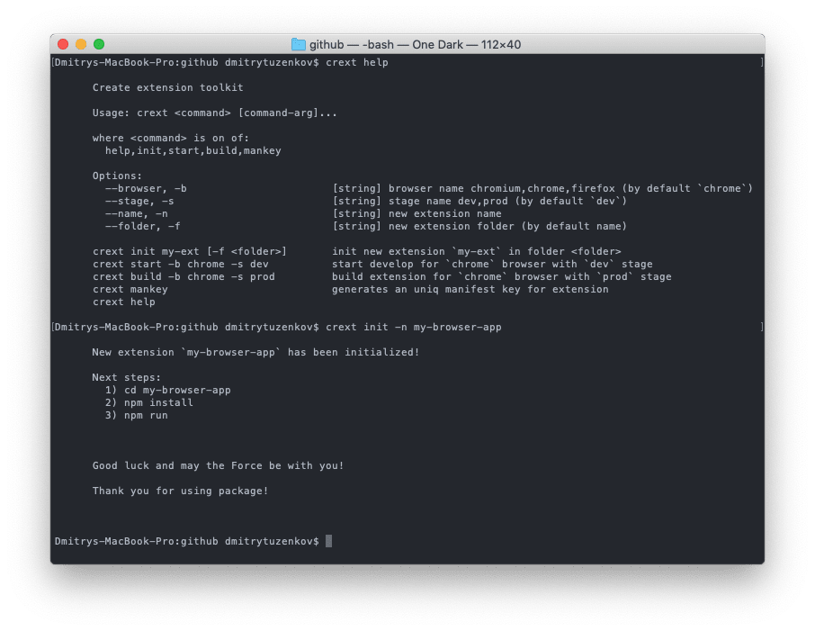
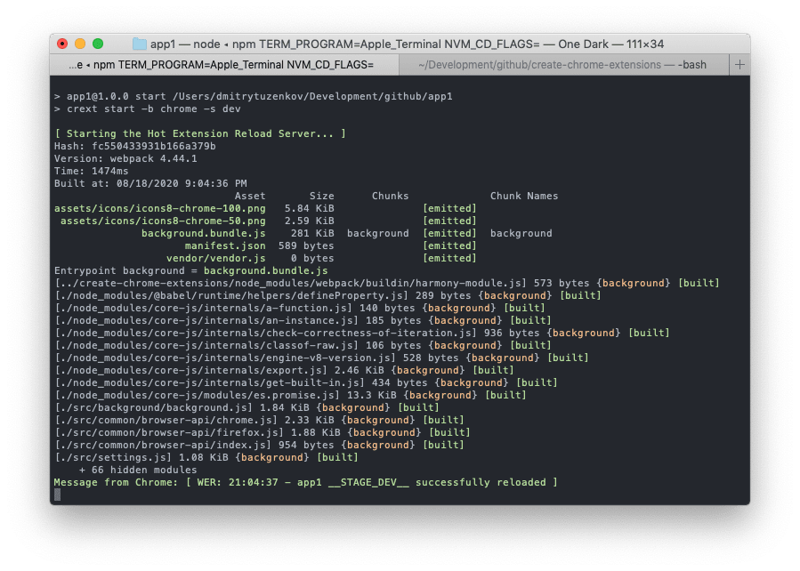

# Crext
Create react chrome extension toolkit (Create chrome extensions)


## Quick Overview

```
npm i crext -g
```

Create react app browser extension works on chrome and firefox.
If something doesn’t work or you have a proposal, please [create an issue](https://github.com/dmitry-tuzenkov/create-chrome-extensions/issues/new)

[Add image or gif with terminal]


## Get started

Node version from 12.

### npm

```
crext init my-ext
```


It will create a folder` my-ext` with new extension inside

```
cd my-ext
```

Inside newly created project, run 

```
npm install
```

To make all packages install correctly


**npm start**

Runs the extension app in development mode for chrome browser

```
crext start -b chrome -s dev // defined at scripts section in package.json
```

or

```
npm start
```



**npm run build**

Builds the extension app for production use and delpoy to chrome webstore

```
crext build -b chrome -s prod // defined at scripts section in package.json
```

or

```
npm run build:chrome
```


### License

Create Chrome Extensions is open source software [licensed as MIT](https://github.com/dmitry-tuzenkov/create-chrome-extensions/blob/master/LICENSE)
